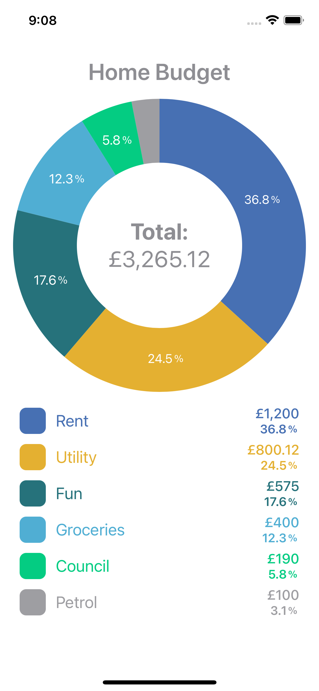
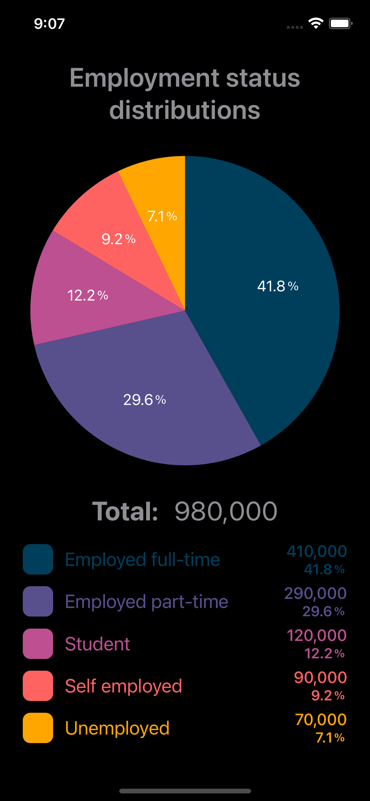

# Communicate:

This Swift Packacge repo will no longer maintained since Aplle integrated `SwiftUICharts` native framework for iOS versions 16+. Since then, I consider this Swift Package as reduntant and will no more update it, unless asked nicely for some project which needs to support old iOS version.

## SwiftUICharts
A charting library for SwiftUI.

### Current Charts

| Donut   |      Pie      |
|:----------:|:-------------:|
|  |   |

Sample usage with [SpaceX lanches monitoring app](https://github.com/otaviokz/SpaceX)

## Usage

The repo includes a [demo app](https://github.com/otaviokz/SwiftUICharts/tree/develop/SwiftUIChartdsDemoApp)

## Installation
- Add SwiftUICharts in Xcode using its Github repository url. (File > Add Packages)
- [Repo](https://github.com/otaviokz/SwiftUICharts)

## Author
Otavio Zabaleta: otaviokz@gmail.com

## License
SwiftUICharts is available under the MIT license. See the [LICENSE](LICENSE) file for more info.

